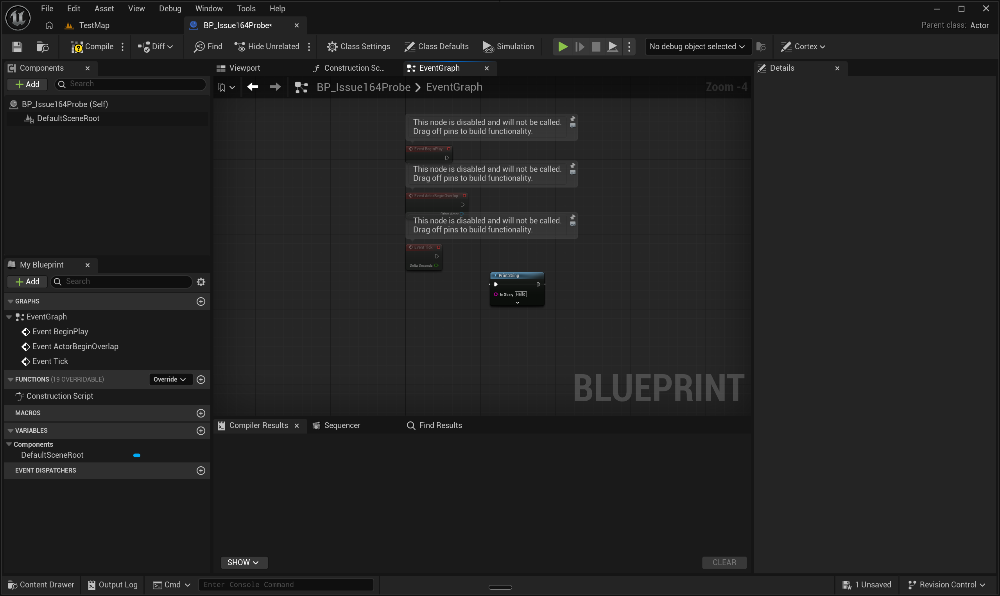
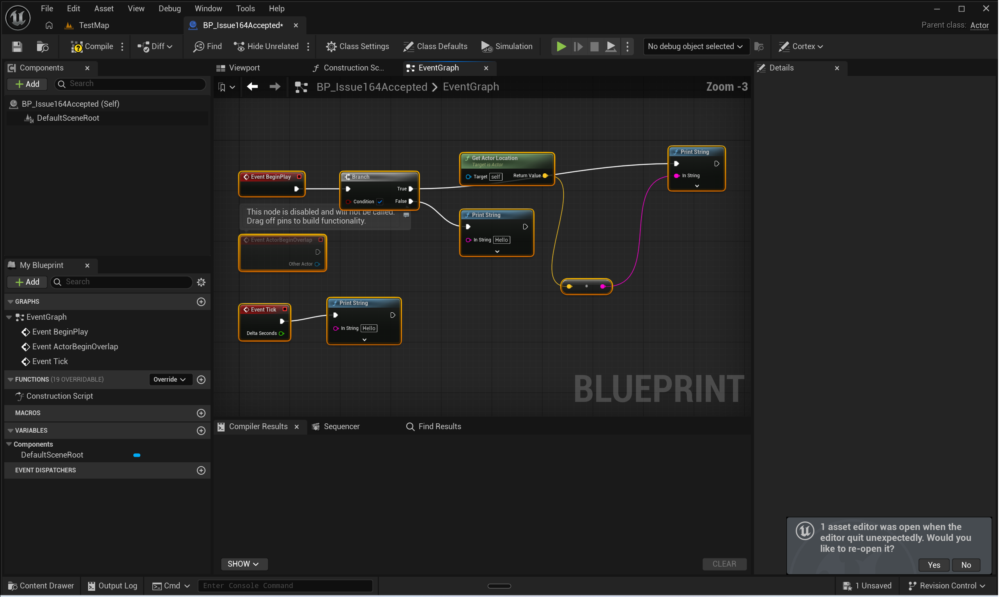
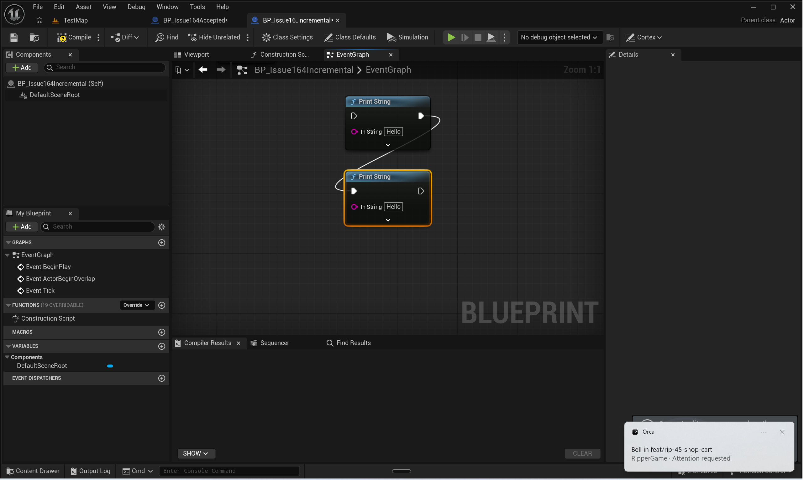
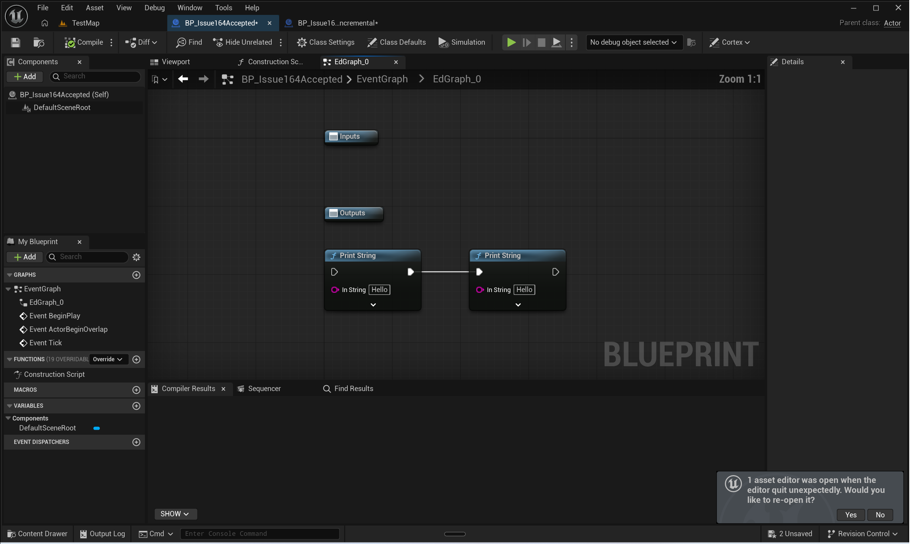
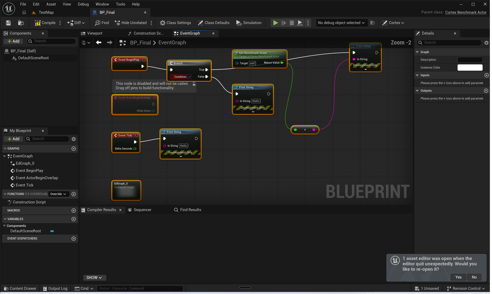
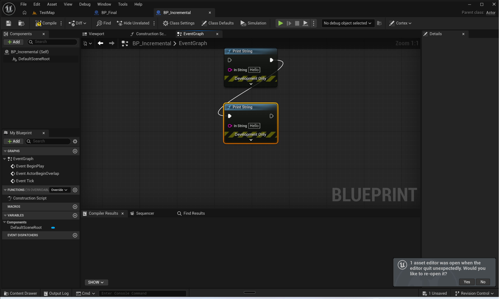
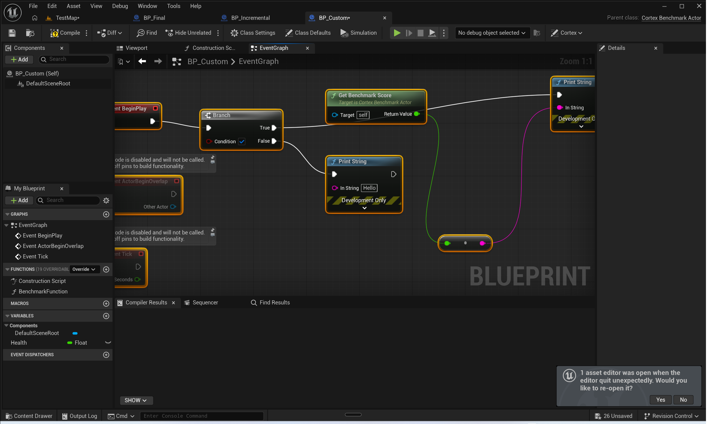
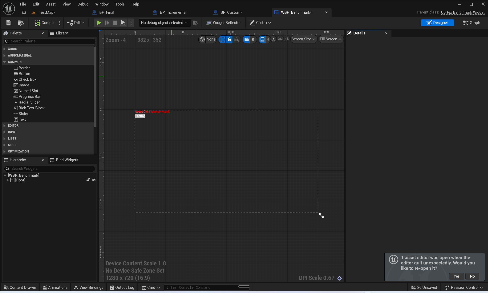
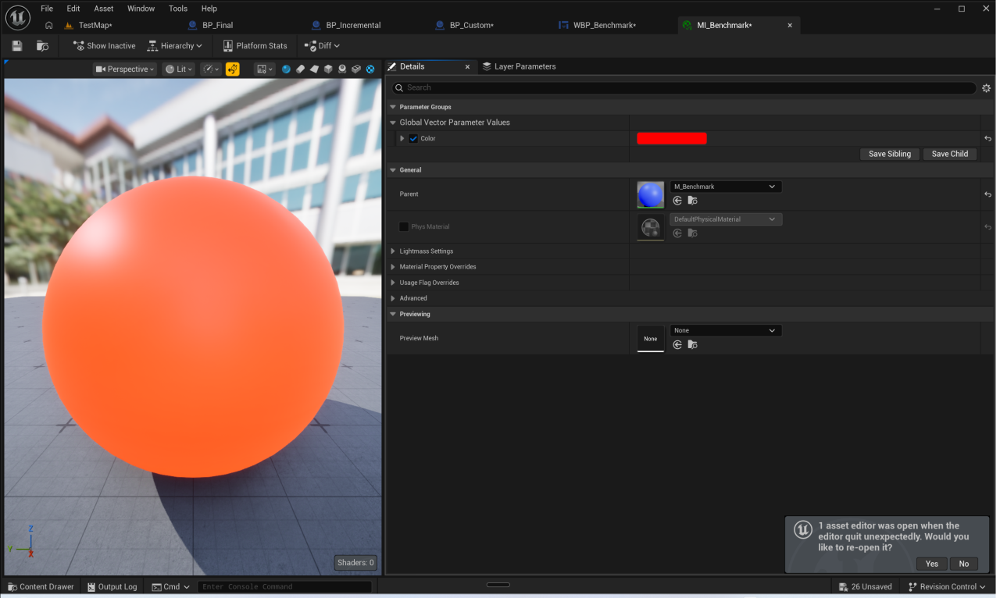
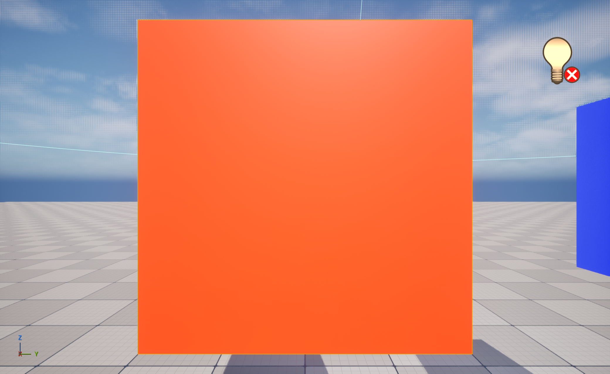

# Issue #164 — Blueprint node layout verification

Issue: [UnrealCortex #164](https://github.com/etelyatn/UnrealCortex/issues/164), reported by @etelyatn.
Environment: CortexSandbox, Windows x64, installed UE 5.8.3, UnrealCortex 0.3.5. Plugin base: `439507be42c4b4f3c8cf9ac4361efd6d40042075`.

## Acceptance ledger

| Issue criterion | Observed proof | Result |
|---|---|---|
| Body spacing and readable execution/data flow | Actual factory-width native regression; fresh mixed BeginPlay/branch/pure-producer/Tick Editor image | Pass |
| Initially piled-up nodes arranged | Baseline incremental stacking reproduced; fixed generic obstacle regression and fresh runtime body clearance | Pass |
| Full exact graph / incremental preservation | Root/child byte-for-byte isolation; only eligible B moves while all established coordinates remain exact | Pass |
| Layout-only identities/connections/defaults/behavior | Exact complete non-position snapshot equality before/after; GUID/link/pin regression; independent compilation with zero errors/warnings | Pass |
| Editor and explicit saved/reloaded coordinates agree | Actual final screenshots plus exact first save/reload root/child/incremental snapshots | Pass |
| Stable same graph/options | Immediate repeat and first-reload full/child/incremental repeat unchanged; clean package dry-run save | Pass |
| Generic regression plus visual proof | Failing-before native fixtures, final321/321 Graph tests, disposable generic/custom-parent Actor visual fixtures | Pass |

## Confirmed baseline

Two connected PrintString calls reproduce incremental stacking: established A and newly reset B both end at `(288,384)`. This is a native routing/layout failure, not a skipped formatter or absent Editor refresh. The currently registered MCP surface is `graph_cmd(command="auto_layout", params=...)`; the issue's legacy standalone tool name is not revived.

Baseline behavioral RED evidence, workspace `Saved/TestLogs/`:

| Regression | Log | Observed failure |
|---|---|---|
| Incremental collision | `AutomationTest_2026-10-05_135434.log` | New body overlaps established obstacle |
| Adapter no-op | `AutomationTest_2026-10-05_135755.log` | Unchanged formatting dirties package |
| Actual widget width | `AutomationTest_2026-10-05_140217.log` | Long native call title loses horizontal clearance; no-op dirty failure |
| Exact child selection | `AutomationTest_2026-10-05_140902.log` | Unbound child path silently formats roots |

Stored `BlueprintEditorLibrary.get_node_size` is not sufficient body proof. The width regression uses the engine node-widget factory/prepass, then actual Editor inspection confirms the result.

## Candidate runtime acceptance

The complex disposable Actor Blueprint contains BeginPlay→Branch→two PrintString branches, a pure ActorLocation→vector/string producer chain, a separate Tick→PrintString root, and an unconnected default overlap event. Full formatting preserves non-position readback exactly. Repeated formatting has identical complete graph readback.

The original incremental collision is reproduced with established A deliberately occupying B's full-layout candidate and B reset to `(0,0)`. Only B moves, to `(272,592)`, while A stays `(272,432)` and all other established positions remain exact. GUIDs, links and defaults remain unchanged. The next incremental call reports `node_count=0`, `changed_node_count=0`, `unchanged=true`.

An exact `EventGraph` / `EdGraph_0` composite-child request formats its four child nodes, leaves the root snapshot unchanged, and repeats without movement. Formatting the root subsequently leaves the child unchanged.

Explicit `core.save_asset` and `core.reload_asset` preserve complete root, child and incremental readbacks. Dry-run save inspection confirms clean packages after no-op formatting. Layout itself neither compiles nor saves. Separate Blueprint compilation returned zero errors and warnings.

Real stdio MCP initializes `cortex_mcp.server`, checks CortexSandbox/PID/port identity, discovers mode/spacing controls, requests the authoritative live operation schema, calls `graph_cmd` incremental layout and reads noncompact nodes/edges. Evidence: workspace `Saved/Issue164McpEvidence.json`. Direct native evidence: `Saved/Issue164AcceptanceEvidence.json` and `Saved/Issue164SavedSnapshots.json`. The session-mounted MCP endpoint was disconnected; the real stdio server path was exercised instead.

The final corrected candidate was exercised through a fresh real stdio MCP session on owned Editor78572/port8743. Fresh assets: `/Game/Temp/Issue164Final_20261005_155454/BP_Final` and `BP_Incremental`. BeginPlay/branch/two calls, inherited pure score→double/string producer, separate Tick/call, disconnected overlap and exact composite child all preserve complete non-position snapshots. After their **first** explicit save/reload, full root/child and incremental reformatting report unchanged, exact saved readbacks persist, and dry-run save shows clean packages. Evidence: `Saved/Issue164FinalAcceptanceEvidence.json`, including per-call timings, source SHA256s and tested CortexGraph DLL SHA256 `e1ad0407b9d080684063e7c3b7b4ad956dbb52796f0c191f8b30eb42c856f048`.

The initial throwaway recipe selected removed UE5.8 `Conv_FloatToString`; authoritative `describe_node` resolved `Conv_DoubleToString`/`InDouble`, and the fresh corrected recipe completed all assertions. No product change or fallback was added for the harness selector error.

## Independent review corrections

The first review found two Important issues; both were verified in source before correction:

1. Newly authored calls skipped `UK2Node_CallFunction::PostPlacedNewNode`. Engine loading later applies DevelopmentOnly metadata to PrintString and adds its height-bearing banner. The first save/reload preserved coordinates, but reformatting then moved eight nodes. Initialization now happens immediately after successful function binding in the shared construction owner, covering legacy add, probes, guarded preview and guarded apply; layout never changes enabled state. Both legacy load-hook and guarded actual-package save/reload regressions passed.
2. A negative-coordinate fixed body could push a candidate back to `(0,0)` after the initial sentinel guard. The sentinel invariant now also holds after every displacement, with clearance rechecked. The failing-before regression and the final full suite confirm the next incremental call has no eligible node.

Correction REDs: `145200` (legacy initial presentation/loading drift), `145355` (negative-coordinate sentinel), and `154146` (valid public-handler preview/apply initial presentation). Earlier guarded fixture refusals for malformed UUID and missing preview token were corrected before counting RED. Independent review round3 found no remaining evidence-backed consumer-visible issue; runtime first-save/reload proof remained its explicit completion gate.

## Verification runs

| Check | Result | Evidence |
|---|---|---|
| MSVC Editor build before review corrections | Success; changed Graph actions warning-free | Final build job bg_11 |
| Full rendering native `Cortex+` before review corrections | 1699/1699; Graph319/319; Material64/64 | `Saved/TestLogs/AutomationTest_2026-10-05_141116.log` |
| Python non-E2E/scenario/stress | 942 passed, 265 deselected | Isolated-temp pytest run bg_15 |
| Real stdio MCP layout/schema | Passed | `Saved/Issue164McpEvidence.json` |
| Final shared-owner MSVC Editor build | Success, four actions, no warnings | bg_28 |
| Final rendering native `Cortex+` | 1701/1701; Graph321/321; Material64/64; zero raw warnings | `Saved/TestLogs/AutomationTest_2026-10-05_154720.log` |
| Fresh corrected stdio MCP first-save/reload acceptance | All assertions passed, 24.86s; actual final full/incremental visuals observed | `Saved/Issue164FinalAcceptanceEvidence.json`; final screenshots above |
| Live Python E2E stage | 190 passed, 2 skipped, 1015 deselected;109.75s | `Saved/Issue164FinalE2E.xml` |
| Live Python scenario stage | 59 passed, 1148 deselected;379.23s | `Saved/Issue164FinalScenario.xml` |
| Live Python stress stage | 14 passed, 1193 deselected;411.38s | `Saved/Issue164FinalStress.xml` |

Combined Python stages:1205 passed/2 skipped of1207 collected. E2E skips are `test_list_data_layers` (DataLayerEditorSubsystem unavailable in current context) and unattended `test_save_all` (existing unstable/modal save workflow). Explicit issue-specific save/reload was exercised separately, not skipped. Source/runtime identity and benchmark timings are preserved in [evidence-identity.json](assets/issue164/evidence-identity.json).

## Live cross-domain MCP benchmark

Fresh path `/Game/Temp/CortexMCPTest/Bench_20261005_160239`; actual stdio routers, owned Editor78572/port8743. 12 checks passed; one separate reference-scan fixture skipped because its copied StringTable has no table-backed references. No failed final checks. Structured call/timing archive: `Saved/Issue164Benchmark_20261005_160239.json`. The first two throwaway runs exposed harness selector/shape/assertion mistakes (including reusing the StringTable package name for StateTree), all recorded and corrected without product changes.

| Check | Result | Wall ms |
|---|---|---:|
| Connection/core identity | Pass |35 |
| Data safe row roundtrip/cleanup and good/bad tags | Pass |148 |
| Ordered localization preview/apply/readback | Pass |90 |
| StringTable reference scan | Skip: no benchmark references |0 |
| Blueprint/custom C++ parent mixed graph | Pass |879 |
| StateTree Idle/Chase transition, fingerprints, validation/compile | Pass |226 |
| Animation duplicate notify dry-run/add/update/remove | Pass |317 |
| UMG custom parent, five-widget tree, text/font/color readback | Pass |565 |
| Material graph/instance RGBA override | Pass |476 |
| Editor scene/capture/Python/CVars/PIE lifecycle | Pass |1586 |
| Level transforms/tags/folder/attachment/property/components/selection | Pass |1072 |
| Reflect scan/hierarchy/detail/context/overrides/usages/rebuild | Pass |346 |
| Schema generated catalog and domain content | Pass |221 |

Visuals observed: inherited score node/flow and parent class, custom-parent widget designer with red title/button label, red instance sphere versus blue parent thumbnail, and real red/blue mesh scene. User chose deletion after verification:23 recorded assets and8 exact-label/class-guarded actors removed, instances before parent materials and StateTrees with current fingerprints. Structured delete results report success, all23 asset files are absent, and `find_actors("Issue164*")` returns0. Shared map was not saved. Evidence: `Saved/Issue164BenchmarkCleanupEvidence.json`.

The final native log has zero raw warnings. Its single native `Error:` is the expected exclusive-port exhaustion assertion, inside passing `Cortex.Core.TcpServer.ExclusivePort`; negative Python exception diagnostics are also inside successful bounded-error tests. Earlier runs emitted two unchanged animation compressed-data warnings; these did not recur in the final run. The initial whole rebuild emitted pre-existing C4996 deprecations in unrelated modules; corrected Graph-only builds were warning-free.

Ordinary `uv run` could not replace an existing locked `cortex-mcp.exe`; `uv run --no-sync` used the installed environment without killing its owner. Default pytest temporary-directory setup was inaccessible; a unique workspace `--basetemp` resolved setup without a product change. An intermediate native run failed a map-save test because a separately launched task Editor held TestMap open; that Editor was closed, and subsequent native/manual Editor stages were serialized. Another native run hit the runner's default120-second total deadline; the unchanged suite completed in216seconds with supported `-Timeout600`. The initial combined live Python attempt timed out; final staged E2E/scenario/stress runs completed without failures. Corrected runtime/visual acceptance and all-domain benchmark are complete.

## Workspace isolation

No unrelated Editor was terminated. Pre-existing parent plugin gitlink and compilation-database changes remain excluded from publication. After the private Build.cs dependencies changed, the navigation database was regenerated for this checkout (538 local plugin entries, zero Mirror roots); the original dirty database is preserved as `Saved/Issue164OriginalCompileCommands.json`. Toolkit and parent system-reference updates are published on separate documentation-only branches under user authorization.

## Integrated delivery

- [UnrealCortex PR165](https://github.com/etelyatn/UnrealCortex/pull/165): reviewed/tested head `308831de8aadd4511f82049c87d7ac76019d1e93`, base `439507be42c4b4f3c8cf9ac4361efd6d40042075`, merged `1bc54a240160c679feedced6b034a35e260e7766`.
- [Toolkit PR64](https://github.com/etelyatn/cortex-toolkit/pull/64): head `ad671418c8f459fcd8f1800c3bc3cd99a87d5cfd`, base `110960a927297bf146b80ae1c8462ae610a7412b`, merged `cfd66bf4840e5143a23520303c660f16d3d12035`.
- [CortexSandbox documentation PR115](https://github.com/etelyatn/CortexSandbox/pull/115): head `5b304e5d3d7046c904eed73a8257b0f342c71033`, base `d6a922d5ccf0cc74e7e3d1f6e77b5d9df24d2b18`, merged `033a2f4b465f081dc373596c369678da0eb46e5e`.

All remote heads/bases were current, clean and mergeable, with no configured checks; merges used full expected-head protection without bypass. All three local defaults fast-forwarded normally. Issue164 closure was observed after PR165 merged.

Post-integration proof: `Source/` and `MCP/` are byte-identical between tested head and merge; all CortexGraph source SHA256s and the loaded candidate DLL hash match the acceptance manifest. Actual root/child/incremental formatting remains unchanged with zero changed nodes. A real stdio MCP post-merge call returns eligible0/changed0/unchangedtrue and noncompact graph readback. Evidence: `Saved/Issue164PostMergeEvidence.json` and the refreshed `Saved/Issue164McpEvidence.json`.

Exercised environment is Windows x64/installed UE5.8.3 only; no native Linux/macOS claim. Parent `Content/Blueprints/BP_ComplexActor.uasset`, `Content/Maps/TestMap.umap`, gitlinks and `compile_commands.json` remain uncommitted/preserved; no cleanup resets those files.
